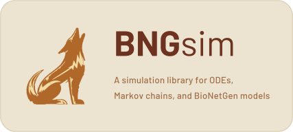

# bngsim

**Embeddable simulation engine for BioNetGen reaction networks.**

`bngsim` is a high-performance C++ simulation kernel with Python bindings that replaces
BioNetGen's subprocess-based `run_network` driver. It loads BioNetGen `.net` and `.xml` files, runs deterministic
and stochastic simulations in-process, and returns results as NumPy arrays —
no file I/O, no subprocess spawning, no Perl dependency.

## Highlights

- **Fast** — in-process execution with the GIL released during simulation; thread-parallel batch sweeps
- **No toolchain at runtime** — `import bngsim`; no compilers, no `BNGPATH`, no Perl
- **Modern SUNDIALS** — v7.x CVODE/CVODES with re-entrant `SUNContext`
- **Multi-format** — loads BioNetGen `.net` and `.xml`, Antimony (`.ant`), and SBML (`.xml`) models [SBML Test Suite results](https://sbml.bioquant.uni-heidelberg.de/Submission/Details/72)
- **Rich results** — NumPy arrays, named observable access, pandas/xarray, HDF5 save/load
- **Standards interchange** — `.net`/cBNGL ⇄ SBML and SED-ML + OMEX packaging, every conversion *verified faithful*
- **Gradient-ready** — CVODES forward sensitivities, Fisher information, JAX-differentiable RHS
- **Validated** — matches `run_network` to ~10⁻¹² (ODE) and cross-checked against RoadRunner and the SBML semantic test suite

## Installation

```bash
pip install bngsim
```

Prebuilt wheels ship for common platforms; large / genome-scale models benefit from the
optional sparse (KLU) solver. See the [installation guide](docs/installation.md) for
source builds, the KLU dependency, and optional extras.

## Quickstart

```python
import bngsim

# Load a model (.net, Antimony, or SBML) and run an ODE simulation
model = bngsim.Model.from_net_file("model.net")
sim = bngsim.Simulator(model, method="ode")
result = sim.run(t_end=100.0, n_steps=1000)

result.times          # (1001,) NumPy array of time points
result["A"]           # trajectory of observable "A"
result.to_dataframe() # pandas DataFrame of all observables
```

Stochastic (`method="ssa"` / `"psa"`), network-free (NFsim / RuleMonkey), sensitivity
analysis, steady-state, and events are all covered in the [quickstart](docs/quickstart.md)
and [user guide](docs/index.md).

## Documentation

Full documentation is hosted at **[bngsim.readthedocs.io](https://bngsim.readthedocs.io)**
and lives in [`docs/`](docs/):

- [Installation](docs/installation.md) · [Quickstart](docs/quickstart.md)
- User guide — [loading models](docs/user-guide/loading-models.md),
  [simulation](docs/user-guide/simulation.md),
  [network-free](docs/user-guide/network-free.md),
  [results](docs/user-guide/results.md),
  [events](docs/user-guide/events.md),
  [sensitivities](docs/user-guide/sensitivities.md),
  [steady state](docs/user-guide/steady-state.md),
  [SBML/SED-ML/OMEX interchange](docs/user-guide/interchange.md)
- Reference — [API](docs/reference/api.md) · [expression language](docs/reference/expressions.md)
- [Architecture](docs/about/architecture.md) · [benchmarks & validation](docs/about/benchmarks.md)

## Benchmarks & validation

`bngsim` beats `run_network` on every SSA/PSA model measured (geometric-mean speedup
~8.7× SSA), agrees with libRoadRunner across the full BioModels ODE corpus, and scores
1577 `Match` on the SBML semantic test suite with **zero** wrong-but-plausible answers.
The numbers, methodology, and reproducible harnesses are in
[benchmarks & validation](docs/about/benchmarks.md), with the committed cross-engine
snapshots under [`parity_checks/`](parity_checks/). To re-run the suites and reproduce the
numbers — the pinned-fetch model, corpus provenance, tool versions, and a no-download smoke
path — see [`REPRODUCING.md`](REPRODUCING.md). The supported-construct matrix is in
[`SUPPORT_MATRIX.md`](SUPPORT_MATRIX.md).

## Contributing

Build-from-source, test, and CI instructions are in [`CONTRIBUTING.md`](CONTRIBUTING.md)
and the [development docs](docs/development/building.md). Release history is in
[`CHANGELOG.md`](CHANGELOG.md).

## License

MIT. See [LICENSE](LICENSE) for the full text and the Triad/LANL copyright notice.

Third-party code and model/test-data corpora that BNGsim redistributes are
listed, with their licenses, in [NOTICE](NOTICE).

© 2026. Triad National Security, LLC. All rights reserved. This is a Los Alamos National
Laboratory open-source release; LANL software release reference **O5098**.

## Citation

If you use `bngsim` in your research, please cite:

> Preprint coming soon!

## Acknowledgments

BNGsim was developed and validated against RoadRunner, AMICI, COPASI, BioNetGen,
and the SBML/DSMTS test suites. See [ACKNOWLEDGMENTS.md](ACKNOWLEDGMENTS.md) for
citations.
